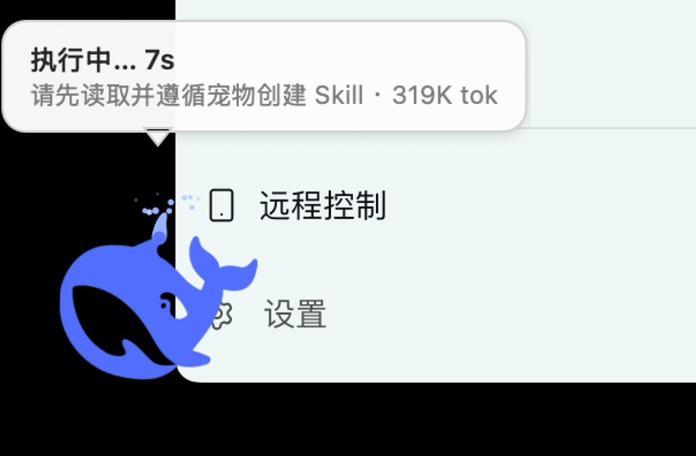
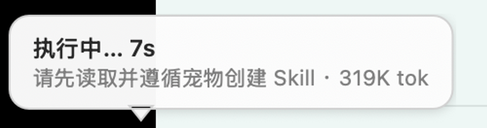
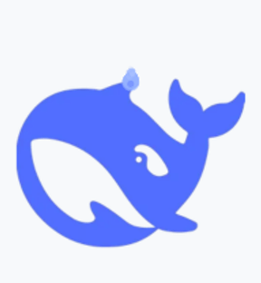
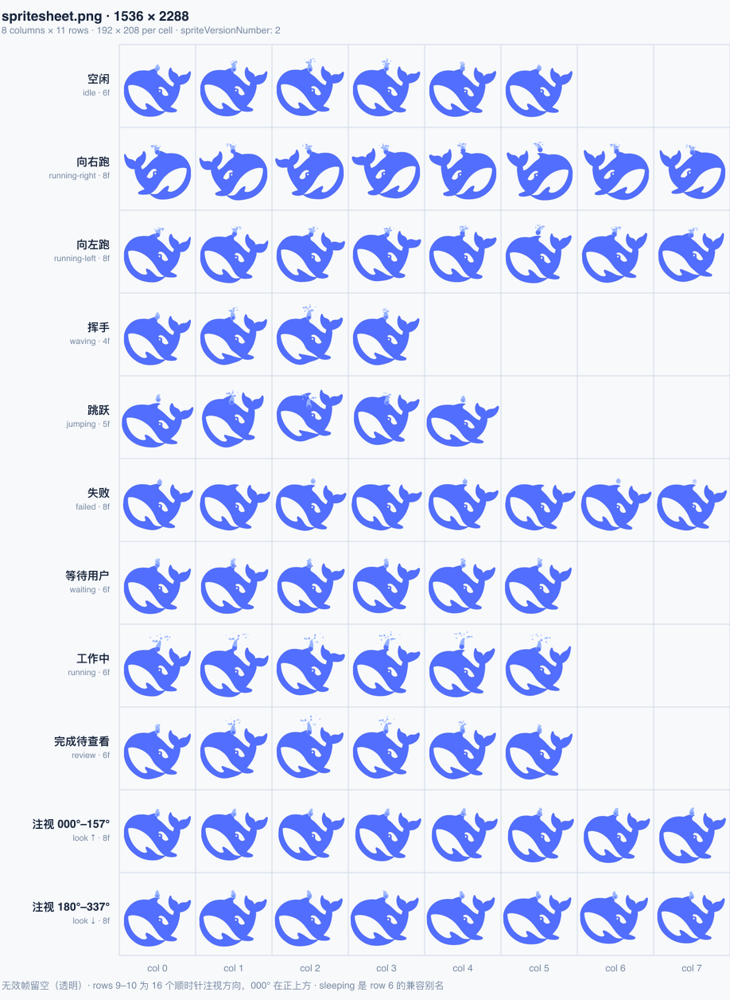

<div align="center">



# SpoutWhale

一个 macOS 桌宠。一只蓝鲸浮在桌面上摆尾喷水，光标移过去会转头看你，
旁边还会弹个气泡说明 DeepSeek Harness 现在在干什么。

Swift + AppKit，没有 Electron 也没有运行时依赖，App 本体 1.5 MB。

[](https://github.com/MrCypressBai/dsh-spout-whale/releases/latest)


</div>

---

## 装上试试

不想自己编译就去 [Releases](https://github.com/MrCypressBai/dsh-spout-whale/releases/latest) 下：

| 文件 | 用途 |
| --- | --- |
| `SpoutWhale-1.0.0-macos-universal.zip` | 解压出 `SpoutWhale.app`，拖进「应用程序」就行 |
| `spout-whale-pet-1.0.0.tar.gz` | 给装了 `@michengai/dsh-codex-pet` 插件的人，解压到 `~/.dsh/codex-pet/pets/` |

包是 ad-hoc 签名、没做公证，首次打开会被 macOS 拦一次。右键点图标 → 打开 → 弹窗里再点一次「打开」就好了。嫌麻烦就用命令行：

```bash
xattr -dr com.apple.quarantine /Applications/SpoutWhale.app
```

Intel 和 Apple Silicon 都能原生跑，不需要 Rosetta。

## 怎么用

拖动身体换位置，单击挥手，右键出菜单（换姿态、大小、开关气泡、退出）。菜单栏也有个 🐳 图标，功能一样。

没 Dock 图标，不抢焦点，焦点在哪个应用都跟它无关。

闲着的时候它自己会游动、跳跃、喷水，游到屏幕边上会停下转向。光标在附近它会转头看你——按 22.5° 分成 16 个方向，正上方是 0°，跟 Codex 图集协议的注视行对齐。

位置和大小记在 `UserDefaults` 里。想恢复默认（左下角、1× 大小）：

```bash
# 先退掉 App
defaults delete ai.micheng.spoutwhale
```

别只删 plist，`cfprefsd` 会缓存旧值，删了也没用。

关掉之后想再打开，双击 App 就行，或者：

```bash
sh scripts/spoutwhale-ctl.sh start     # 也可以 stop / restart / status
```

从哪条路启动都只会有一个进程——`open` 靠 LaunchServices 去重，直接跑二进制时 App 自己按 bundle id 查一遍。

写的时候顺手想过做成 DSH 插件，最后没做。一是目标本来就是"脱离浏览器"，塞回网页里就没意义了；二是拿状态只要读文件，不需要走宿主 API。

## 状态气泡



气泡读的是 DSH 自己写在磁盘上的会话投影，属于纯文件读取——不用改 DSH，不用装插件，不用重启：

```
~/.dsh/storages/session_projcache_archive_manager_v2/sessions/session_*.json
~/.dsh/storages/session_projcache/sessions/session-*.json
```

每 0.7 秒扫一次，挑 mtime 最新的那个会话，从 `record.rows.*.val` 里判断状态：

| 字段 | 状态 | 姿态 |
| --- | --- | --- |
| `userQuestions.questions.active` 非空 | 等你回答 N 个问题 | 等待用户（行 6） |
| `llmRetry` 非空，或 `goal.failure` | 重试中…(N) / 出错了 | 失败（行 5） |
| `sessionStats.pendingCalls` 非空 | 执行中… Ns | 工作中（行 7） |
| `openStep.firstTokenTime` 为空 | 思考中… | 工作中（行 7） |
| 有 `openStep` 或 `openTurnStartSeq` | 生成中… | 工作中（行 7） |
| `openTurnStartSeq` 为空 | 空闲中（气泡收起） | 先播一次行 8 再回空闲 |

副行是会话标题、待办进度和已解码 token。工具那里显示的秒数是真的——`pendingCalls` 里存了每个调用的起始时间戳，减一下就出来了，不是自己数的。

### 状态过期了怎么办

投影里的行值是**变了才写盘**。所以文件旧不代表状态旧：跑一个 20 分钟的构建，这中间文件一个字都不会动。

但反过来，如果 DSH 被杀掉或者崩在工具执行中途，文件就永远停在那一刻，`pendingCalls` 一直非空，气泡会挂着「执行中… 3600s」不放。所以加了两道：

1. DSH 进程还在不在。用 `NSRunningApplication` 按 bundle id 查一下，不在就直接当空闲。
2. 投影文件超过 30 分钟没动过，也当空闲。这个数字是拍的：比任何合理的单步都长，又不至于让气泡永远卡着。

这个功能依赖 `@michengai/dsh-archive-manager` 插件写出的投影文件。插件被卸了气泡就自动不显示，宠物退回自己玩，不会报错。不想用的话右键关掉「状态气泡」就行。

## 动画



顺序是空闲 → 工作中 → 挥手 → 跳跃 → 完成待查看 → 等待用户 → 失败 → 16 个注视方向 → 回到空闲，帧时长跟 `lib/client.js` 里那张表一致。



图集是协议规定的 1536×2288，8 列 11 行，每格 192×208，`spriteVersionNumber: 2`。帧数按行固定：6/8/8/4/5/8/6/6/6，最后两行是 16 个注视方向，没有的格子留空。

`pet.json` 和 `spritesheet.png` 就是 `@michengai/dsh-codex-pet` 插件要的那两个文件，把这个目录丢进 `~/.dsh/codex-pet/pets/` 它同时也能当网页版宠物用。

## 图集是怎么来的

做这个最麻烦的地方是 88 帧之间角色不能变形——尾巴会飘、眼睛会跑、体型会忽大忽小。生成模型干这个恰恰最不稳。

所以没用生图，走的是一张参考图 + 确定性变形：

```
参考图
  │ tools/sprite.mjs   抠图、去白边、连通域清理
  ▼
sprite.png (474×349 RGBA)
  │ tools/render.mjs   位移场反向映射 + 预乘双线性 + 2×2 超采样
  │ tools/actions.mjs  11 组动作参数
  ▼
spritesheet.png (1536×2288)
  │ tools/verify.mjs   逐格包围盒 / 越界 / 无效帧留空
```

位移场是连续的：沿体轴的正弦位移，振幅随离头部越远越大，所以尾巴摆得最狠、头部基本不动（头要是跟着动，整只角色就"飘"起来了）。胸鳍和尾鳍另外叠一层局部旋转。

因为是反查像素而不是切图层，接缝这事儿根本不会发生——没有图层可分。喷水是唯一手画的部分：一条竖直水柱加 12 颗扇形水花，颜色比身体浅一档，不然会跟头顶脊糊成一根角。

管道全在 `tools/` 里。参考图没放进来，想重跑就自己找张同风格的图命名成 `src.webp`——`sprite.mjs` 里的几何参数是照着原来那张调的，换图要重调。

## 自己编译

```bash
git clone https://github.com/MrCypressBai/dsh-spout-whale.git
cd dsh-spout-whale
sh desktop/build.sh ./SpoutWhale.app
```

`build.sh` 里写死了本机验证过的工具链组合，换机器可能要改：

- 编译器用 Xcode 自带的 `swiftc`。**别用 Command Line Tools 那个**——CLT 的 swiftc 6.2.3 配 CLT 的 SDK 26.2 版本对不上，会报 `this SDK is not supported by the compiler`。
- SDK 用 `MacOSX15.5.sdk`
- `-module-cache-path /tmp/swift-mc`，默认缓存目录在有些环境写不进去
- `-swift-version 5`

默认出通用二进制（x86_64 + arm64 各编一份再 `lipo` 合起来），某个架构编挂了会自动退回单架构，不会整个构建失败。只要一个：

```bash
ARCHS="arm64" sh desktop/build.sh ./SpoutWhale.app
```

跑起来之后：

```bash
sh scripts/spoutwhale-ctl.sh start     # start / stop / restart / status
```

想装到 `~/Applications` 并开机自启：

```bash
sh scripts/install.sh "$HOME/Applications" --autostart
```

## 目录

```
dsh-spout-whale/
├── pet.json                 # 宠物清单
├── spritesheet.png          # 1536×2288 图集
├── desktop/
│   ├── main.swift           # 窗口、行为调度、拖拽、菜单、持久化
│   ├── status.swift         # DSH 状态读取 + 气泡
│   ├── Info.plist
│   └── build.sh
├── scripts/
│   ├── install.sh
│   ├── spoutwhale-ctl.sh
│   └── ai.micheng.spoutwhale.plist
├── tools/                   # 图集生成管线
└── docs/images/
```

## 命令行参数

平时用不上，都是自测和排查用的。

| 参数 | 作用 |
| --- | --- |
| `--selftest` | 逐格校验图集：有效帧得有内容，无效帧得是空的 |
| `--statustest` | 状态推导的 10 个分支 + 4 条过期判断 |
| `--drivetest` | 事件链路：拖拽、点击、菜单、落盘、姿态行、注视命中 |
| `--at x,y` | 指定初始位置 |
| `--pose <key>` | 固定某个姿态 |
| `--status-dir <path>` | 换成受控目录，用来注入假状态 |
| `--level <n>` / `--log <path>` / `--force` | 面板层级 / 日志 / 跳过多实例检查 |

## 测过什么、没测什么

三项自测都是过的（`--selftest`、`--statustest`、`--drivetest`，退出码 0）。其中状态这块，我用 `--status-dir` 注入假状态跑了一遍端到端：注入「思考中」宠物切到行 7，注入「等待」切到行 6，注入「重试」切到行 5，注入「空闲」先播一次行 8 再回行 0，App 自己记的变更日志跟这些一一对上。真实状态下截的图里，气泡写着「执行中… 7s」，跟当时那次调用实际跑了多久一致。

顺手修掉的几个坑，都是跑起来才发现的：

- **直接执行二进制会开出第二只。** `open SpoutWhale.app` 两次只有一个进程（LaunchServices 会去重），但直接跑二进制两次就是两个进程。而 LaunchAgent 走的就是直接跑二进制这条路。两只鲸鱼各记一份位置、互相覆盖气泡。现在 App 按 bundle id 查一遍，已经在跑就直接退出。
- **`mtime` 拿进来没用。** 状态推导里一直带着 mtime，但从来没读过。第二道闸就是补这个。
- **跑自测会改掉你的设置。** `--drivetest` 会真拖窗口、真遍历大小菜单、还要断言位置落盘，跑完 `defaults read` 里就躺着 `scale=1.5` 和一堆坐标。现在自测模式读写都走单独的域，真实域跑完还是不存在。

没测的是真人鼠标点击。这台机器上三条合成输入的路全废了：驱动的 HID 点击连 macOS 菜单栏的 Apple 菜单都点不开，`postToPid` 报发送成功但 App 里的事件监听一个都没收到，AppleScript 直接权限违例（-10004）。所以拖拽和点击目前只有事件处理器层的证据——`--drivetest` 喂的是真的 `NSEvent`，跑的就是线上那份 `mouseDown/mouseDragged/mouseUp`——但系统层没有证据。这个我不想含糊过去。

多显示器和运行中改分辨率也没处理，位置只在启动的时候夹回可见区。

## 许可

代码 MIT，见 [LICENSE](LICENSE)。

鲸鱼造型是从作者提供的参考图派生的（DeepSeek 风格的蓝鲸标志），只当个人学习和你自己桌面装饰用。商标和原始标志的权利归对方。要商用自己确认授权。

图集协议参考 [petx](https://github.com/IchenDEV/petx)。
